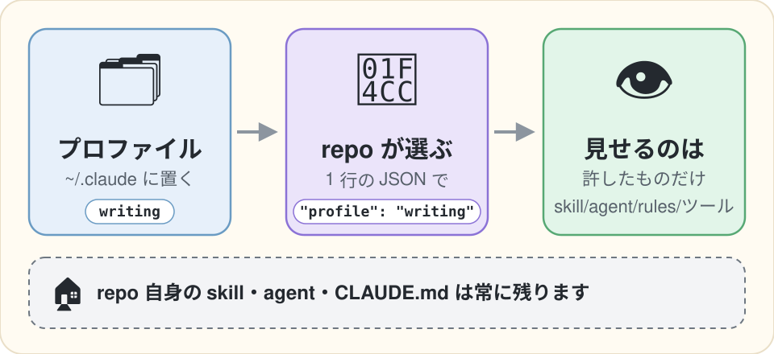

[English](README.md) | [日本語](README.ja.md)

# harness-scope

ハーネスはグローバルに 1 つ。Claude に何を見せるかは repo が選ぶ。


<p align="center">
  
</p>

harness-scope は、グローバルの skill・agent・指示ファイル（CLAUDE.md と rules）・ツールを repo ごとに ON/OFF する Claude Code の Mod（plugin の hooks module）です。名前付きのプロファイルを `~/.claude` に一度置き、repo は 1 行でそのうち 1 つを選びます。Claude に見えるのは、そのプロファイルが許したものだけです。repo 自身の skill・agent・CLAUDE.md は常に残ります。

ここでいうハーネスは、`~/.claude` の CLAUDE.md・rules・skill・agent と plugin の一式です。ハーネスは、エッセイを書く repo のように大半が要らない場所にも付いてきます。harness-scope は、そこに困っている Claude Code 利用者に向けたものです。私はコーディング用の設定を執筆 repo から外すために作りました。関連する記事は [著者のほかの仕事](#more-from-the-author) にあります。

## Why

Claude Code は、どの repo にも同じグローバルのハーネスを見せます。私の執筆 repo では skill の一覧に 101 件が並んでいました。repo 自身のものは 7 件で、残る 94 件はグローバルの設定・plugin・組み込み・claude.ai から来たもので、`tdd` もその中にありました。

ネイティブの設定（`skillOverrides`・`enabledPlugins`・`claudeMdExcludes`・`permissions.deny`）でも project 単位で外せますし、2.1.287 では実際に効きます。ただ、どれも repo ごとの settings に書く拒否リストで、次の 3 つが足りません。

- **許可リストが無い。** あとから `~/.claude` に足した skill は、各 repo の拒否リストに足すまで、どの repo にも出ます。
- **plugin の扱いが粗い。** `skillOverrides` が効くのは自分の skill だけです。plugin の skill は plugin ごとにしか ON/OFF できず、組み込みと claude.ai から同期された skill は 1 つずつ選べません。
- **repo 間で共有するまとまりが無い。** 各 repo の settings に手で書き写すことになります。

harness-scope は、これを名前付きのプロファイルで埋めます。skill・agent・指示ファイル・ツールを 1 つのプロファイルでまとめて扱うので、何かが OFF になっている理由を探す場所も 1 か所です。

## Quick start

Mods が既定で有効になった Claude Code 2.1.287 以降が必要です。ほかのアカウントや API キーは要りません。

1. Mod を user scope に一度だけ入れます。

   ```bash
   claude plugin marketplace add shimo4228/harness-scope
   claude plugin install harness-scope@harness-scope
   ```

   clone から試すときは `claude --plugin-dir <clone のパス>/plugin` で起動します。

2. プロファイルを決めます。同梱の `writing` はそのまま使えます。自分で書くときは [Profiles](#profiles) を見てください。

3. repo に `.claude/harness-scope.json` を置きます。

   ```json
   { "profile": "writing" }
   ```

その repo で新しい会話を始めるか、`/clear` を打ちます。画面に、プロファイルの名前と、それを選んだファイルが 1 行出ます。`/harness-scope` を打つと、外したものと、何にも一致しなかったパターンが出ます。対話のセッションでは、この一覧は画面に出るだけで会話には入りません。画面の無い `claude -p` では、コマンドの出力として返るので Claude にも見えます。

このファイルの無い repo は何も変わりません。

## Profiles

プロファイルは `~/.claude/harness-scope/profiles/<name>.json` に置く JSON ファイルです。カテゴリごとに `allow`（これだけ残す）か `deny`（これだけ外す）のどちらか 1 つを書きます。名前とパスには `*` と `?` の glob が使えます。書かなかったカテゴリはそのまま残ります。

```json
{
  "skills":       { "allow": ["writing-ecosystem", "prose-translation", "anthropic-skills:docx"] },
  "agents":       { "allow": ["Explore", "general-purpose"] },
  "instructions": { "deny":  ["~/.claude/rules/common/testing.md"] },
  "tools":        { "deny":  ["LSP", "NotebookEdit", "mcp__claude_ai_Slack__*"] }
}
```

- `skills` と `agents` は、Claude の一覧に載っている名前で照合します。自分のもの、plugin のもの（`plugin:skill`）、組み込み、claude.ai から同期されたもの、どれでも同じです。
- `instructions` は自分の指示ファイルのパスで照合し、`~/` が使えます。`@` で取り込まれたファイルは、取り込んだ側と一緒に外れます。
- `tools` はツール名で照合します。MCP のツールも含みます。

同梱の `writing` は、repo 自身の skill と Explore・general-purpose の 2 つの agent だけを残し、LSP・NotebookEdit・EnterWorktree・ExitWorktree を外します。指示ファイルには触れません。`~/.claude/harness-scope/profiles/` に同じ名前のファイルがあれば、そちらが優先されます。

repo 側のファイルは、まずセッションの root、次に git repo の root で探します。

## What it leaves alone

プロファイルに何を書いても、次のものには触れません。

- repo 自身の skill と agent、そして自分のもの以外の指示ファイル（repo の CLAUDE.md と rules、local と managed のファイル、auto memory）。
- hook やほかの plugin が足したリマインダー。
- `.claude/harness-scope.json` の無い repo。ファイルが壊れているときや、知らないプロファイル名のときも何も変えず、理由を画面に 1 行出します。見覚えの無い形式の一覧も、そのまま通します。

repo 側のファイルに書けるのはプロファイルの名前だけです。clone した repo が独自のプロファイルを定義して利用者の rules を外すことはできず、できるのは利用者のプロファイルから 1 つ選ぶことだけです。選んだときは画面に 1 行出ます。

この Mod が読むのは、プロファイル、repo 側のファイル、`HOME`、そして repo 自身の skill を見分けるために Claude Code から受け取る「読み込まれた skill とそれぞれの出どころ」の一覧だけです。外部への通信、プロセスの起動、モデルの呼び出しはしません。

## What changes

2026-10-03 に Claude Code 2.1.287 の `claude -p` で、私の執筆 repo に同梱の `writing` を当てて測りました。

| | harness-scope なし | `writing` あり |
|---|---|---|
| skill の一覧 | 101 件、26,551 字 | repo 自身の 7 件、1,623 字 |
| agent の一覧 | 38 種類、18,988 字 | repo 自身の 7 種類 + Explore・general-purpose、4,134 字 |
| OFF の skill（`tdd`）を Skill ツールで呼ぶ | 読み込まれる | 理由つきで断られる |

この数字は、入れている skill・plugin・MCP サーバーの数で大きく変わります。

主な効果は、context が減ることより、関係の無い skill が見えなくなることです。Claude Code は skill の一覧を予算（context window の 1%）いっぱいまで使い、収まるように説明を短くします。少し外しても一覧はほとんど縮みません。ある計測では 3 件外しても一覧は 26,551 字から 26,534 字にしか減らず、空いた分は残った skill の説明に回ったと見られます。許可リストで大半を外せば、一覧そのものが縮みます。

## Compared with

目的の近いほかの手段との違いです。

| | 何か | harness-scope との違い |
|---|---|---|
| ネイティブの設定 | 各 repo の `.claude/settings.json` に書く、repo ごとの拒否リスト | 許可リスト、共有できる名前付きプロファイル、plugin の skill を 1 つずつ外すことを足す |
| [claude-loadout](https://pypi.org/project/ccloadout/) | Claude Code の前に挟むランチャー。手元のモデルが repo ごとに MCP サーバー・plugin・skill を選ぶ | ランチャーが要らないので起動の仕方を問わない。決定的に動く。agent と rules も扱う |
| [bridle](https://github.com/neiii/bridle) | Claude Code（とほかのエージェント）の設定をプロファイルで丸ごと切り替える設定マネージャー | 設定は 1 つのまま、repo ごとに絞る |

## Limitations

- 制御するのは Claude に見せるものまでで、読めるかどうかではありません。Claude が skill の SKILL.md を直接開けば読めます。
- 会話の途中から付く指示ファイル（`paths:` 付きの rule、下位ディレクトリの CLAUDE.md）は外れません。
- ここで OFF にしたツールは ToolSearch の後ろに回り、呼ばれると断られますが、ネイティブの `permissions.deny` のように完全には消えません。完全に消すには `permissions.deny` を使ってください。プロファイルをそこへ同期するコマンドを v0.2 で予定しています。
- プロファイルの変更は、新しい会話か `/clear` から効きます。
- 自分の agent が組み込みと同じ名前（Explore など）だと、OFF にしたとき組み込みのほうも見えなくなります。
- skill の説明の中に `- name: text` の形の行があると、別の skill と読まれることがあります。
- 確認したのは Claude Code 2.1.287 だけです。一覧の形式は版で変わりえます。見覚えの無い形式はそのまま通すので、壊れたときは「何も外れない」という形で現れます。
- 2.1.287 では、試験の 9 回中 1 回で Mod が読み込まれず、エラーも出ないまま全部がそのまま通りました。原因はまだ確かめていません。

## Design notes

提案と先行例は [rfcs/0001-prose-mod.md](rfcs/0001-prose-mod.md)、設計は [docs/plans/rfc-0001-r2-profile-allowlist.md](docs/plans/rfc-0001-r2-profile-allowlist.md)、上の数字の元になった計測は [docs/measurements/2026-10-03-phase0.md](docs/measurements/2026-10-03-phase0.md) にあります。

Mod に手を入れるときは `npm ci` のあと `.claude/verify.sh`（Biome、TypeScript、`claude plugin validate --strict`、`claude plugin test`、`npm audit`）を通します。

## More from the author

- **Claude Codeに2つ目のハーネスを持たせる**（[Zenn](https://zenn.dev/shimo4228/articles/claude-code-claudemd-excludes) / [Dev.to、英語](https://dev.to/shimo4228/give-claude-code-a-second-harness-27of)）: 実験用にハーネスを丸ごと持ち替える方法です。`CLAUDE_CONFIG_DIR` で skill と agent は入れ替わりますが CLAUDE.md と rules は残り、残りは `claudeMdExcludes` で外せることが分かります。
- **[claude-harness](https://github.com/shimo4228/claude-harness)**: この Mod が執筆 repo で絞っている、私自身のハーネス（rules・skill・agent）です。
- **[shimo4228](https://github.com/shimo4228/shimo4228)**: 私のほかのプロジェクトと文章の一覧です。

## License

[MIT](LICENSE)
