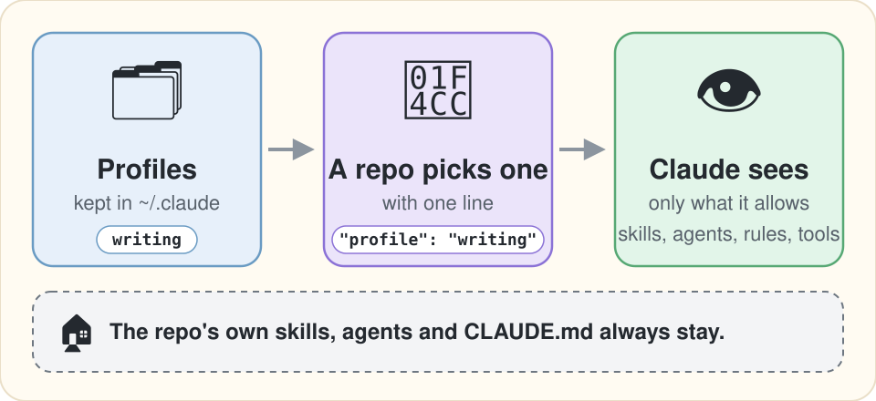

[English](README.md) | [日本語](README.ja.md)

# harness-scope

Keep one global harness. Let each repo pick what Claude sees.


<p align="center">
  
</p>

harness-scope is a Claude Code Mod (a plugin's hooks module) that turns your global skills, agents, instruction files (CLAUDE.md and rules) and tools on or off per repo. You keep named profiles once in `~/.claude`. A repo picks one with a single line, and Claude sees only what that profile allows. The repo's own skills, agents and CLAUDE.md always stay.

It is for Claude Code users whose harness (the CLAUDE.md, rules, skills and agents under `~/.claude`, plus plugins) follows them into repos where most of it does not belong, such as a repo for writing essays. I built it to keep my coding setup out of my writing repo; related articles are under [More from the author](#more-from-the-author).

## Why

Claude Code shows every repo the same global harness. In my writing repo, the skill listing held 101 skills: the repo's own 7, and 94 from my global setup, plugins, built-ins and claude.ai, `tdd` among them.

The native settings (`skillOverrides`, `enabledPlugins`, `claudeMdExcludes`, `permissions.deny`) can turn these off at project scope, and on 2.1.287 they do. Each one is a denylist written into each repo's settings, which leaves three gaps:

- **No allowlist.** A skill you add to `~/.claude` later appears in every repo until you deny it there too.
- **Coarse control over plugins.** `skillOverrides` covers your own skills; a plugin's skills go on or off with the whole plugin, and built-in and claude.ai-synced skills cannot be picked one by one.
- **No shared sets.** Each repo's settings are copied by hand.

harness-scope fills these gaps with named profiles. One profile covers skills, agents, instruction files and tools together, so there is one place to look when something is off.

## Quick start

You need Claude Code 2.1.287 or later, where Mods are on by default. No other account or API key.

1. Install the Mod once, at user scope:

   ```bash
   claude plugin marketplace add shimo4228/harness-scope
   claude plugin install harness-scope@harness-scope
   ```

   To try it from a clone instead, start Claude Code with `claude --plugin-dir <path to the clone>/plugin`. Loaded that way, the Mod cannot tell where `~/.claude` is, so only the bundled profiles work until you set it with `claude plugin configure harness-scope` (the `configDir` field).

2. Choose a profile. The bundled `writing` profile works as is. To write your own, see [Profiles](#profiles).

3. In the repo, add `.claude/harness-scope.json`:

   ```json
   { "profile": "writing" }
   ```

Start a new conversation in that repo, or run `/clear`. A line on screen names the profile and the file that picked it. Run `/harness-scope` to see what it turned off and which patterns matched nothing. In an interactive session the list stays on your screen and out of the conversation. Under `claude -p`, where there is no screen, it comes back as the command's output, so Claude sees it too.

Repos without this file are not changed.

## Profiles

A profile is a JSON file at `~/.claude/harness-scope/profiles/<name>.json`. Each category takes either `allow` (keep only these) or `deny` (turn off only these). Names and paths accept `*` and `?` globs. A category left out stays as it is.

```json
{
  "skills":       { "allow": ["writing-ecosystem", "prose-translation", "anthropic-skills:docx"] },
  "agents":       { "allow": ["Explore", "general-purpose"] },
  "instructions": { "deny":  ["~/.claude/rules/common/testing.md"] },
  "tools":        { "deny":  ["LSP", "NotebookEdit", "mcp__claude_ai_Slack__*"] }
}
```

- `skills` and `agents` match names as they appear in Claude's listings, whatever their source: your own, a plugin's (`plugin:skill`), built-in, or synced from claude.ai.
- `instructions` matches paths of your own instruction files, and `~/` works. A file pulled in with `@` goes with the file that imported it.
- `tools` matches tool names, MCP tools included.

The bundled `writing` profile keeps only the repo's own skills and the Explore and general-purpose agents, and turns off LSP, NotebookEdit, EnterWorktree and ExitWorktree. It leaves instruction files alone. A profile file of the same name in `~/.claude/harness-scope/profiles/` takes precedence over the bundled one.

The repo file is looked up in the session's root directory first, then in the git repo's root.

## What it leaves alone

Whatever a profile says, harness-scope does not touch:

- The repo's own skills and agents, and every instruction file that is not yours: the repo's CLAUDE.md and rules, local and managed files, and auto memory.
- Reminders added by hooks or other plugins.
- Repos without `.claude/harness-scope.json`. A broken file or an unknown profile name changes nothing, and a line on screen says why. A listing in a format it does not recognize passes through unchanged.

The repo file can only name a profile. A cloned repo cannot define its own profile and use it to turn off your rules; it can only pick one of yours, and a line on screen tells you when it does.

The Mod reads the profile, the repo file, and the list of skills Claude Code has loaded with where each came from (to tell the repo's own skills apart). It reads no environment variables: it finds `~/.claude` from where the plugin is installed. It makes no network requests, starts no processes and calls no model.

## What changes

Measured on 2026-10-03 with Claude Code 2.1.287 and `claude -p`, in my writing repo with the bundled `writing` profile:

| | Without harness-scope | With `writing` |
|---|---|---|
| Skill listing | 101 skills, 26,551 chars | the repo's own 7, 1,623 chars |
| Agent listing | 38 types, 18,988 chars | the repo's own 7 + Explore, general-purpose; 4,134 chars |
| Calling an off skill (`tdd`) with the Skill tool | loads | refused, with the reason |

These numbers depend heavily on how many skills, plugins and MCP servers you have.

The main effect is that unrelated skills drop out of view, more than a smaller context. Claude Code fills the skill listing up to a budget (1% of the context window) and shortens descriptions to fit. Turning off a few skills hardly shrinks it: in one test, turning off 3 skills took the listing only from 26,551 to 26,534 characters, and the freed space appears to have gone to fuller descriptions of the rest. Turning off most of them, as an allowlist does, shrinks the listing.

## Compared with

Other ways to narrow what Claude sees:

| | What it is | How harness-scope differs |
|---|---|---|
| Native settings | Per-repo denylists in each repo's `.claude/settings.json` | Adds allowlists, shared named profiles, and single plugin skills |
| [claude-loadout](https://pypi.org/project/ccloadout/) | A launcher in front of Claude Code; a local model picks MCP servers, plugins and skills per repo | No launcher, so it works however Claude Code starts; deterministic; also covers agents and rules |
| [bridle](https://github.com/neiii/bridle) | A config manager that switches whole Claude Code (and other agents') configurations by profile | Keeps one configuration and narrows it per repo |

## Limitations

- It controls what Claude is shown, not what Claude can read. Claude can still open a skill's SKILL.md file directly.
- Instruction files attached later in a conversation (rules with `paths:`, CLAUDE.md files in subdirectories) are not turned off.
- A tool turned off here is moved behind ToolSearch and refused when called, but it does not vanish the way a native `permissions.deny` entry makes it. For that, use `permissions.deny`; a command to sync profiles into it is planned for v0.2.
- Profile changes apply from a new conversation or `/clear`.
- If one of your own agents has the same name as a built-in one (such as Explore), turning it off hides the built-in as well.
- A line inside a skill description shaped like `- name: text` can be read as a separate skill.
- Checked on Claude Code 2.1.287 only. Listing formats can change between releases; a format it does not recognize passes through unchanged, so a break shows up as nothing being turned off.
- On 2.1.287 the Mod was not loaded in 1 of 9 test runs, with no error shown, and that run passed everything through. The cause is not confirmed yet.

## Design notes

The proposal and prior art are in [rfcs/0001-prose-mod.md](rfcs/0001-prose-mod.md), the design in [docs/plans/rfc-0001-r2-profile-allowlist.md](docs/plans/rfc-0001-r2-profile-allowlist.md), and the measurements behind the numbers above in [docs/measurements/2026-10-03-phase0.md](docs/measurements/2026-10-03-phase0.md) (all in Japanese).

To work on the Mod: `npm ci`, then `.claude/verify.sh` (Biome, TypeScript, `claude plugin validate --strict`, `claude plugin test`, `npm audit`).

## More from the author

- **Give Claude Code a Second Harness** ([Dev.to](https://dev.to/shimo4228/give-claude-code-a-second-harness-27of) / [Zenn, Japanese](https://zenn.dev/shimo4228/articles/claude-code-claudemd-excludes)): swapping the whole harness for experiments. `CLAUDE_CONFIG_DIR` moves skills and agents but leaves CLAUDE.md and rules behind; `claudeMdExcludes` covers the rest.
- **[claude-harness](https://github.com/shimo4228/claude-harness)**: the personal harness (rules, skills, agents) that this Mod narrows in my writing repo.
- **[shimo4228](https://github.com/shimo4228/shimo4228)**: my other projects and writing.

## License

[MIT](LICENSE)
